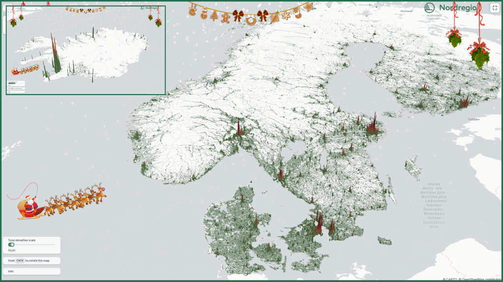

# Santa has granted your wish for an interactive 3D map

The map displays the number of residents in each 1km grid cell, with the height of the bars representing the number of residents in each area. It highlights the stark contrasts in population density throughout the region, showcasing vast tracts of sparsely populated territory alongside bustling urban centres.

## Why the contrast in population density?
Nearly all countries have an uneven distribution of their populations across their territories, but the Nordic populations are more clustered than in most other nations. This phenomenon is due to the location and physical geography of the Nordic region, with Norway, Sweden, and Finland having territory extending above the Arctic Circle.

As the map illustrates, much of the population is concentrated in the southern parts of Norway, Sweden, and Finland. The capital cities of Oslo, Stockholm, and Helsinki are clearly visible, along with other large cities such as Malmö and Gothenburg. In the northern regions of these countries, populations are concentrated along the coasts of either the Gulf of Bothnia or the North Sea. The inland areas of the northern regions are notably sparsely populated.

Denmark (6.0 million) has only a slightly larger population than Norway (5.6 million) and Finland (5.6 million), but it is much smaller in size, making it far more densely populated than the other Nordic countries. Denmark does not have the vast stretches of empty land seen in the other countries, but its population is still highly concentrated in and around the capital, Copenhagen.

Iceland is perhaps the most extreme example of population concentration, with two-thirds of the population living in or near the capital, Reykjavik. The second largest city, Akureyri, is also quite prominent on the map, as are a few other settlements. However, the map vividly illustrates the emptiness of much of the island.

## New urban-rural typology as of 2024
The map is built using the deck.gl framework and features population data structured in a 1×1 km grid. The data presented in the map is from 2022, with Iceland’s data sourced from 2017. This dataset was also utilised to create the Nordic urban-rural typology, a tool designed for studying spatial phenomena and enabling more accurate cross-Nordic statistical analysis. The typology, which includes seven classes based on varying degrees of urbanity and rurality, provides a nuanced understanding of territorial differences across the Nordic countries and Åland. Unfortunately, Greenland and the Faroe Islands could not be included due to a lack of grid data.

Read more about how the Nordic urban-rural typology was developed [here](https://nordregio.org/publications/towards-a-grid-based-nordic-territorial-typology/).

